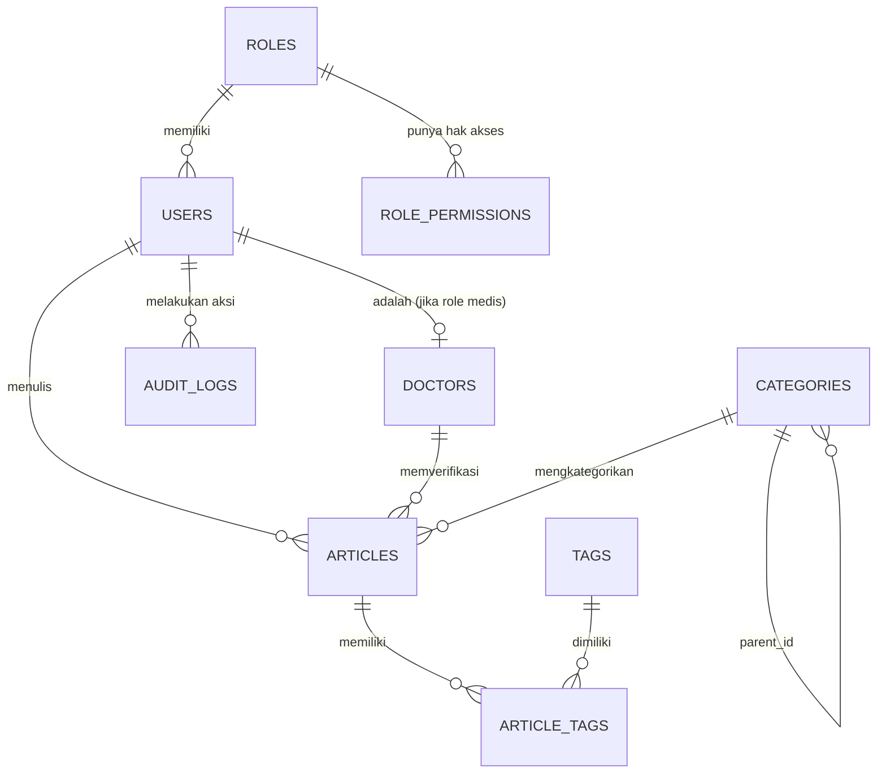

# Senadee - Desain Skema Database (CMS & Portal)

Dokumen ini berisi rancangan skema database relasional (SQL) yang disiapkan untuk mendukung seluruh fungsionalitas Backend dari sistem **Senadee**, khususnya bagian CMS (Content Management System) dan Portal Pembaca.

> [!NOTE]
> Desain ini menggunakan tipe data yang umum digunakan di PostgreSQL (seperti `UUID` dan `JSONB`). Jika Anda menggunakan MySQL, tipe data dapat disesuaikan (misal: `VARCHAR(36)` untuk UUID dan `JSON` untuk JSONB).

## Entity Relationship Diagram (ERD)

---

## Spesifikasi Tabel

### 1. Modul Autentikasi & Otorisasi

#### `roles` (Peran Pengguna)
Menyimpan daftar peran seperti *Superuser*, *Editor*, *Penulis*, dan *Verifikator Medis*.
| Kolom | Tipe Data | Keterangan |
| :--- | :--- | :--- |
| `id` | UUID | Primary Key |
| `name` | VARCHAR(50) | Nama peran (Superuser, Penulis, dll) |
| `description` | TEXT | Deskripsi peran |
| `created_at` | TIMESTAMP | Waktu pembuatan |

#### `role_permissions` (Hak Akses Peran)
Menyimpan daftar hak akses terperinci dari masing-masing peran (misal: `manage_users`, `publish_articles`).
| Kolom | Tipe Data | Keterangan |
| :--- | :--- | :--- |
| `id` | UUID | Primary Key |
| `role_id` | UUID | Foreign Key -> `roles.id` |
| `permission` | VARCHAR(50) | Nama izin spesifik |

#### `users` (Pengguna CMS)
Data akun utama untuk login ke dalam CMS.
| Kolom | Tipe Data | Keterangan |
| :--- | :--- | :--- |
| `id` | UUID | Primary Key |
| `email` | VARCHAR(100) | Unik, digunakan untuk login |
| `password_hash` | VARCHAR(255) | Kata sandi yang di-hash |
| `full_name` | VARCHAR(100) | Nama lengkap pengguna |
| `role_id` | UUID | Foreign Key -> `roles.id` |
| `is_active` | BOOLEAN | Status aktif akun (default: true) |
| `last_login_at` | TIMESTAMP | Waktu login terakhir |
| `created_at` | TIMESTAMP | |
| `updated_at` | TIMESTAMP | |

---

### 2. Modul Medis (Verifikator)

#### `doctors` (Data Dokter/Tim Medis)
Tabel ekstensi untuk pengguna yang memiliki lisensi medis (Verifikator).
| Kolom | Tipe Data | Keterangan |
| :--- | :--- | :--- |
| `id` | UUID | Primary Key |
| `user_id` | UUID | Foreign Key -> `users.id` (Unik) |
| `sip_number` | VARCHAR(100) | Surat Izin Praktik |
| `specialization` | VARCHAR(100)| Spesialisasi (misal: Dokter Umum, Gizi) |
| `hospital` | VARCHAR(150) | Tempat praktik / RS |
| `is_verified` | BOOLEAN | Status verifikasi lisensi medis |
| `created_at` | TIMESTAMP | |

---

### 3. Modul Konten (Artikel)

#### `categories` (Kategori Artikel)
Mengelola Pilar Kesehatan dan kategori turunannya.
| Kolom | Tipe Data | Keterangan |
| :--- | :--- | :--- |
| `id` | UUID | Primary Key |
| `name` | VARCHAR(100) | Nama kategori |
| `slug` | VARCHAR(100) | URL Slug yang unik |
| `parent_id` | UUID | Foreign Key -> `categories.id` (Bisa null) |
| `icon` | VARCHAR(50) | Material symbol icon (opsional) |
| `order_index` | INT | Urutan tampilan (Menu Order) |

#### `tags` (Label Artikel)
| Kolom | Tipe Data | Keterangan |
| :--- | :--- | :--- |
| `id` | UUID | Primary Key |
| `name` | VARCHAR(50) | Nama tag (unik) |
| `slug` | VARCHAR(50) | URL Slug (unik) |

#### `articles` (Tabel Utama Artikel)
| Kolom | Tipe Data | Keterangan |
| :--- | :--- | :--- |
| `id` | UUID | Primary Key |
| `title` | VARCHAR(255) | Judul artikel |
| `slug` | VARCHAR(255) | URL Slug (unik) |
| `summary` | TEXT | Ringkasan singkat untuk kartu artikel |
| `content` | JSONB / TEXT| Isi artikel (JSONB jika menggunakan Block Editor/TipTap, TEXT jika HTML) |
| `cover_image` | VARCHAR(255) | URL/Path gambar utama |
| `status` | ENUM | `draft`, `in_review`, `published`, `archived` |
| `is_featured`| BOOLEAN | Penanda artikel pilihan / utama |
| `category_id`| UUID | Foreign Key -> `categories.id` |
| `author_id` | UUID | Foreign Key -> `users.id` (Penulis) |
| `verifier_id`| UUID | Foreign Key -> `doctors.id` (Yang memvalidasi medis) |
| `published_at`| TIMESTAMP | Waktu artikel diterbitkan (bisa dijadwalkan) |
| `created_at` | TIMESTAMP | |
| `updated_at` | TIMESTAMP | |

#### `article_tags` (Relasi Many-to-Many)
| Kolom | Tipe Data | Keterangan |
| :--- | :--- | :--- |
| `article_id` | UUID | Foreign Key -> `articles.id` |
| `tag_id` | UUID | Foreign Key -> `tags.id` |

---

### 4. Modul Sistem & Keamanan

#### `audit_logs` (Log Proses / Audit Trail)
Mencatat seluruh aktivitas perubahan data di CMS untuk transparansi dan keamanan.
| Kolom | Tipe Data | Keterangan |
| :--- | :--- | :--- |
| `id` | UUID | Primary Key |
| `user_id` | UUID | Foreign Key -> `users.id` (Siapa yang melakukan) |
| `action` | VARCHAR(50) | `CREATE`, `UPDATE`, `DELETE`, `LOGIN` |
| `entity_type`| VARCHAR(50) | Tabel yang diubah (misal: `articles`, `users`) |
| `entity_id` | UUID | ID baris data yang diubah |
| `old_values` | JSONB | Data sebelum diubah |
| `new_values` | JSONB | Data sesudah diubah |
| `ip_address` | VARCHAR(45) | Alamat IP pengguna |
| `created_at` | TIMESTAMP | Waktu aktivitas |

#### `system_parameters` (Data Parameter Web)
Menyimpan konfigurasi statis web yang bisa diubah via CMS tanpa menyentuh kode (misal: Alamat Email Kontak, Link Sosial Media).
| Kolom | Tipe Data | Keterangan |
| :--- | :--- | :--- |
| `id` | UUID | Primary Key |
| `key` | VARCHAR(100) | Kunci unik (misal: `contact_email`, `ig_link`) |
| `value` | TEXT | Nilai dari konfigurasi |
| `description`| TEXT | Penjelasan konfigurasi |
| `updated_by` | UUID | Foreign Key -> `users.id` |
| `updated_at` | TIMESTAMP | |
